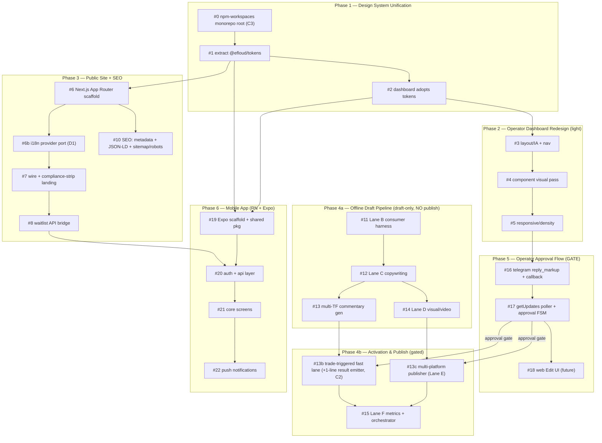

# Efloud Dashboard & Growth-Surface Redesign — Canonical Plan (2026-06-08)

> **Status:** ULTRAREVIEWED & PATCHED (2026-06-08). This is the canonical copy. The plan
> was reconstructed from repo ground-truth, then verified file-by-file in an ultrareview.
> All ground-truth findings (G1–G8) were checked against the repo; **3 material corrections
> (C1–C3) and 3 gaps (D1–D3)** were found and are folded in below. The four open questions
> were resolved by the operator on 2026-06-08 (see "Resolved Decisions").

---

## Ultrareview Resolutions (2026-06-08)

### Resolved Decisions (operator)
1. **Draft TTL (was OQ#4 "1s auto-archive"):** Durable `pending` indefinitely + an
   **optional, default-OFF** TTL (24–72h) that moves a draft to `expired` (**never publishes**).
   Fail-safe = never auto-publish. The literal "1s auto-archive" is discarded.
2. **PnL disclosure (OQ#5):** Result/PnL posts show **ratio/risk metrics only** — R:R, %,
   risk. **Absolute $ is never shown.** This is a hard compliance rule on Lane C/D output.
3. **Canonical domain (OQ#6):** `https://u2algo.com`. Set `NEXT_PUBLIC_SITE_URL=https://u2algo.com`;
   301-redirect the railway host to it. Single sitemap source (`app/sitemap.ts`).
4. **Token distribution (C3):** **npm workspaces monorepo.** Establish a root `package.json`
   with `workspaces`, place shared packages under `packages/`, and update **both** deploy
   configs (Vercel `frontend/` + Railway `u2algo-site/`) to build from the monorepo root.

### Material corrections found in ultrareview (folded into the plan)
- **C1 — Compliance gate targets the REAL banned list.** The banned-phrase list lives in
  `docs/marketing/GO_TO_MARKET_2026-05-28.md:16-22` and is **Turkish promise-phrases**
  ("Kesin kazanç", "Garantili getiri", "Her gün kâr", "Pasif gelir makinesi", "Sinyal al
  kazan", "Fonumuza para yatır"). **"Yatırım tavsiyesi değildir" / "Not investment advice"
  is ALLOWED** (the prescribed disclaimer, `:33,:86`) — *not* banned. Of the hero strings,
  `"73.2%"` violates the no-performance-promise rule (`:8`) and `"guaranteed"`→"Garantili
  getiri"; `"Start Free Demo"`/`"Active Traders"` are fabricated and must be removed but are
  not literal banned phrases. The `compliance.test.ts` (#7) and every pipeline copy job
  (#12/#13/#13c) must grep the **real TR list + a numeric-performance regex**, not a
  fabricated English list. **Disclaimer source already exists in-engine:**
  `engine/content_jobs.py:28-29` `COMPLIANCE_TR/COMPLIANCE_EN` — reuse it.
- **C2 — `position_closed` emits NO content_job event.** Lane A emits only **TWO**
  content_job event types: `content_job.created` (`engine/notifications/__init__.py:77`) and
  `content_job.position_opened` (`:109`, carries `execution{filled,fill_price,quantity,leverage,trace_id}`
  at `:113`). `position_closed` (`:117`) is a plain notification method with no emit. The
  **result/PnL draft path of #13b therefore requires a one-line additive emitter** at
  `notifications/__init__.py:117` (`content_emitter.emit("content_job.position_closed", ...)`)
  — additive, fire-and-forget, but it *does* touch the bot side (still honors the Lane A
  isolation contract). **OQ#2 is "Resolved" for the entry path, REOPENED for the result path.**
- **C3 — No monorepo/workspace exists today.** Repo root has **no `package.json`/workspaces**;
  `frontend/`→Vercel(fra1), `u2algo-site/`→Railway deploy separately. Resolved as npm
  workspaces (decision #4). PR #1's DoD includes the workspace scaffold + both deploy-config
  updates; otherwise "extract once, consume thrice" does not build.

### Gaps found (folded in)
- **D1 — i18n dependency.** 4 of the `landing-reference/*` components import `useI18n` from
  `@/lib/i18n/context`, which **does not exist** in `frontend/` or `u2algo-site/`.
  `RiskDisclaimer` text comes from `t("risk_disclaimer")`. So **#7 must first port an i18n
  provider + dictionary**, and the compliance test must grep the **resolved i18n value**, not
  component source (else a banned phrase hides in the translation JSON).
- **D2 — Second spec.** `docs/superpowers/specs/2026-06-04-content-jobs-consumer-design.md`
  (consumer/dispatcher design) is a source for #11/#13b alongside the lane-b screenshot spec.
- **D3 — `server.js` still reads `DATABASE_URL`.** `u2algo-site/server.js:11` =
  `SUPABASE_DATABASE_URL || DATABASE_URL`. CLAUDE.md says it was removed; the code keeps the
  fallback. #8 must port the 3-tier logic verbatim; do not assume `DATABASE_URL` is gone.

### Path/section corrections
- Content-jobs log default path is **`/app/data/content_jobs/YYYY-MM-DD.jsonl`**
  (`engine/content_jobs.py:30`), env-overridable via `EFLOUD_CONTENT_JOBS_PATH`.
- Lane B consumer **algorithm is §4 ("Akış")** of the screenshot spec; §10 is "PR-ready next
  steps". #11 follows §4 for flow, §10 for PR scoping.
- Lane B budget hard-cap = **$5/day = 300 events** (binding guard), not 250–500.
- `frontend/lib/api.ts` exports `Status/OpenPosition/OpenOrder/Trade` **plus `EquityPoint`,
  `ConfigSnapshot`** — include all six in `packages/shared-types/`.

---

## Context

Efloud has a live SMC trading bot, a **private operator dashboard** (`frontend/`, Next.js 15,
deliberately `noindex` via `frontend/app/layout.tsx:9`), a **static marketing site**
(`u2algo-site/`, hand-rolled `index.html` + `server.js` — **not** Next.js; CLAUDE.md's "Next.js 15"
line is inaccurate, G1), and the first stage of a **content/media pipeline** (Lane A emitter,
shipped & wired, default OFF). The growth operating system
(`.hermes/plans/2026-05-28_efloud-growth-operating-system.md`) mandates: organic-first,
**no performance promises**, research-only, capital-protection > reliability > edge >
productization > marketing, and that growth work must not mutate `config.yaml`/`.env`/
`docker-compose.prod.yml`/live risk (safety invariant #1).

This plan turns that into an executable redesign across six phases, weighted toward: **Media
Pipeline (Phase 4)**, **multi-timeframe commentary (#13)**, **mobile app (Phase 6)**, **SEO (#10)**,
and the **operator-approval flow (Phase 5)**.

### Ground-truth findings (verified in ultrareview)

| # | Finding | Verdict | Note |
|---|---------|---------|------|
| G1 | Marketing site = static `index.html` + `server.js`; `web/` is a smoke-test stub | ✅ | SEO (#10) requires the #6 App Router migration first. CLAUDE.md "Next.js 15" is wrong. |
| G2 | `brand-kit/landing-reference/*.tsx` are complete Next.js components (15 of them) | ✅ | But they depend on i18n (D1) and contain compliance violations (G3). |
| G3 | Hero hard-codes fabricated metrics | ✅ | `HeroSection.tsx:360,405,407,408`. Strip all; gate via real banned-list (C1). |
| G4 | Lane A emitter live & wired, default OFF | ⚠️ corrected | **Only 2 events** (created, position_opened); `position_closed` emits nothing (C2). Path `/app/data/...`. |
| G5 | Lane B = Manus spec, pull-cron, idempotent, draft-only, Drive→local fallback | ✅ | Budget $5/day=300 (binding); algorithm §4, not §10. |
| G6 | `telegram_client.py` send-only | ✅ | Phase 5 is greenfield (`getUpdates`, callback). |
| G7 | Shared tokens exist | ✅ | `design-tokens.ts` exports `colors/spacing/radius/typography/effects/tw`. |
| G8 | Dashboard API contract fully typed | ✅ | `Status/OpenPosition/OpenOrder/Trade` **+ `EquityPoint`,`ConfigSnapshot`**. |

---

## Phase & PR map

**Critical dependency assertions (validated):**
- **#0 (monorepo root) precedes #1** — no workspace exists today (C3).
- **SEO (#10) ⟂ exists-as-static.** #10 cannot land before #6 (App Router scaffold).
- **#6b (i18n port) sits between #6 and #7** — landing-reference components need `useI18n` (D1).
- **Publish (#13c) and trade-triggered (#13b) are blocked on Phase 5** — no live posting without the gate.
- **Lane A entry path is done; result path needs a 1-line emitter (C2).** #11 consumes an event stream that flows for `created`/`position_opened`; add the `position_closed` emit for #13b's result drafts.
- **Mobile (#19/#20) reuses #1 tokens and `frontend/lib/api.ts` types** — extract once (packages/), consume thrice.

---

## Phase 4 split — Yes (publish boundary)

- **Phase 4a (Offline Draft Pipeline)** — #11, #12, #13, #14. Chart PNG → commentary → copy →
  visual, all to local/Drive, **zero external posting**. Ships in shadow, no compliance exposure.
- **Phase 4b (Activation & Publish)** — #13b, #13c, #15. Trade-triggered fast lane + multi-platform
  publishing, **strictly behind Phase 5's approval gate**. Cannot start until #17 lands.

Phase 5 (approval) is implemented **between** 4a and 4b.

---

## Phase 1 — Design System Unification

- **PR #0 — Monorepo root (C3).** Create root `package.json` with `workspaces: ["frontend",
  "u2algo-site/web", "packages/*", "mobile"]`. Update Vercel (`frontend/vercel.json`) and Railway
  (`u2algo-site/nixpacks.toml`+`railway.json`) to build from the monorepo root so a local
  `packages/*` dependency resolves on both. V: both deploy builds resolve `@efloud/tokens`.
- **PR #1 — Extract `@efloud/tokens`.** Promote `u2algo-site/brand-kit/css/design-tokens.ts` to
  `packages/tokens/` exporting `colors/spacing/radius/typography/effects/tw`. Keep CSS-var sync
  (`globals.css :root`). Add `tokens.tailwind.ts` preset. V: `tsc --noEmit` in package.
- **PR #2 — Dashboard adopts tokens.** Point `frontend/tailwind.config.ts` at the preset; replace
  ad-hoc hex literals in `frontend/components/*` with token classes. Pure refactor.
  V: `npm --prefix frontend run typecheck && npm --prefix frontend test`.

---

## Phase 2 — Operator Dashboard Redesign (intentionally light)

- **PR #3 — Layout & IA.** Tabbed/section-anchored shell (Overview / Positions / Research /
  Config) over `app/page.tsx`; keep all 14 sections. **Preserve the 401→`/login` gate and
  `efloud_demo_mode` bypass (`app/page.tsx:25-32`).** V: typecheck + manual nav.
- **PR #4 — Component visual pass.** Phase-1 tokens on `StatusGrid/PositionsTable/TradesTable/
  EquityChart/InteractiveChart`; unify card/border/glow. V: test + visual.
- **PR #5 — Responsive & density.** Mobile-web breakpoints, table→card collapse, density toggle.

---

## Phase 3 — Public Marketing Site + SEO

- **PR #6 — Next.js App Router scaffold.** Create `u2algo-site/web/` as a real Next.js 15 App
  Router app. Root `app/layout.tsx` consuming `@efloud/tokens` + fonts from
  `brand-kit/css/root-layout.tsx`. Keep `server.js` as the waitlist API for now (or move in #8).
  Update build to `next build && next start`. V: `next build`.
- **PR #6b — i18n provider port (D1).** Port/create `web/lib/i18n/context.tsx` (`useI18n`/`t()`)
  + a TR/EN dictionary, since `landing-reference/*` depends on it. The mandatory
  `risk_disclaimer` key lives here. V: components render with resolved strings.
- **PR #7 — Wire + compliance-strip landing.** Import `HeroSection/FeatureCards/TrustStrip/
  RiskDisclaimer/FAQSection/WaitlistForm/CTABanner`. **Hard gate (G3+C1):** delete every
  fabricated metric (`HeroSection.tsx:360,405,407,408`) and any TR banned phrase. Add
  `web/tests/compliance.test.ts` that greps **rendered output + resolved i18n values** against
  the real `GO_TO_MARKET_2026-05-28.md:16-22` TR list **plus a numeric-performance regex**
  (e.g. `\d+(\.\d+)?\s*%`), failing the build on a hit. `RiskDisclaimer` on every page.
- **PR #8 — Waitlist API bridge.** Port `server.js` 3-tier persistence (Supabase REST → Postgres
  → local JSONL) into `web/app/api/waitlist/route.ts` reusing `@supabase/supabase-js`. **Keep the
  `DATABASE_URL` fallback (D3); preserve the `200 OK` fallback guarantee.**
- **PR #10 — SEO.**
  - Root `metadata`: `metadataBase: new URL("https://u2algo.com")` (decision #6), `title.template`
    `"%s — u2algo"`, `description`, `openGraph`, `twitter` (`summary_large_image`),
    `alternates.canonical`. OG via `app/opengraph-image.tsx` (or reuse launch-asset PNG).
    Per-route static `metadata`; `generateMetadata()` for dynamic routes. **Do not** set
    `robots:noindex` on the public site — that stays only on `frontend/` (`layout.tsx:9`).
  - **JSON-LD:** `SoftwareApplication` (`applicationCategory:"FinanceApplication"`, `offers`),
    `Organization`, `WebSite`, `FAQPage` (from `FAQSection`), `BreadcrumbList`. **AVOID**
    `FinancialProduct`/`InvestmentOrDeposit` — regulatory overreach; document inline.
  - **Sitemap/robots:** `app/sitemap.ts` (`MetadataRoute.Sitemap`), `app/robots.ts`
    (`allow:"/"`, `sitemap`, `host`). Delete static `sitemap.xml`/`robots.txt`. 301 railway→u2algo.com.
  - V: `curl /sitemap.xml /robots.txt`; JSON-LD `@type` unit test; Rich Results manual.

---

## Phase 4a — Offline Draft Pipeline (draft-only)

Consumer-side orchestration of Lanes B→D. Output to local (dev) / Drive (when re-auth'd). **No publish.**

- **PR #11 — Lane B consumer harness.** `scripts/lane_b_consumer.py` per the screenshot spec
  **§4 (flow)** + §10 (PR scope) + `content-jobs-consumer-design.md` (D2): read
  `/app/data/content_jobs/YYYY-MM-DD.jsonl`, filter by `processed_set` (idempotent on
  `event_id`), POST a Manus task (Playwright TradingView screenshot + Gemini structured
  analysis → §3.2 schema), write artifacts, update `processed_set`, Telegram batch summary.
  Honor §6 (8 failure modes) and **§7 budget cap ($5/day = 300 events, binding)**.
  Tests: `backend/tests/test_lane_b_consumer.py` — idempotency, budget guard, local fallback.
- **PR #12 — Lane C copywriting.** `scripts/lane_c_copywriter.py`: consume Lane B analysis, gate
  on `confidence>=medium` (§3.2), produce platform-agnostic copy (caption + thread + alt-text),
  each carrying the disclaimer from `engine/content_jobs.py` `COMPLIANCE_TR/EN` (C1). Banned-phrase
  filter reuses the #7 real-list checker. **Ratio/risk metrics only — no absolute $ (decision #5).**
- **PR #13 — Multi-timeframe commentary generation.** SMC v2 top-down narration (1d→4h→1h→15m→
  invalidation→disclaimer) per CLAUDE.md doctrine chain + Lane B schema. Emits
  `scripts/lane_c/commentary_schema.json` + a human script. Guardrails: no promise language
  ("targets/invalidation", never "will"); banned-phrase + disclaimer-present asserts; **PnL as
  ratio/risk only (decision #5)**. Tests: golden-file render, banned-phrase, disclaimer asserts.
- **PR #14 — Lane D visual/video.** `scripts/lane_d_visual.py`: chart PNG + commentary overlay →
  still + 1080×1920 vertical, basing on `u2algo-site/scripts/generate-launch-pngs.py`. Draft-only.

(Narration script schema and template unchanged from the reconstructed plan; PnL fields carry
ratio/risk only.)

---

## Phase 5 — Operator Approval Flow (the publish gate)

Greenfield (G6). Single operator, no public HTTPS endpoint → **`getUpdates` long-poll**.

- **PR #16 — Inline buttons.** Extend `ops/alerter/telegram_client.py`: optional `reply_markup:
  dict` on `send_message` + an `inline_keyboard([(label, callback_data), ...])` helper.
  `callback_data = draft_id|action` (≤64 bytes). Buttons: ✅ Approve · ✏️ Edit · ❌ Reject.
- **PR #17 — Poller + approval FSM.** `ops/alerter/telegram_poller.py`: offset-tracked
  `getUpdates` (25s timeout), handle `callback_query`, call `answerCallbackQuery` **<10s**, then
  `editMessageReplyMarkup`/`editMessageText`. `DraftStore` (JSONL/SQLite under `state/`) holds
  FSM `pending → approved|rejected|edited|published|failed|expired`. **Drafts persist in
  `pending` indefinitely; optional default-OFF TTL (24–72h) → `expired` (never publishes)
  (decision #1).** Only `approved` drafts feed Lane E. Idempotent on `draft_id`.
- **PR #18 — Web "Edit" UI (future).** `/review` route in `frontend/`: list `pending` drafts,
  inline editor with live banned-phrase highlighting, Approve/Save-edit/Publish → mutate
  `DraftStore`. Deferred until 4b stable.

**Approval edge cases:** answerCallbackQuery before state mutation (no spinning button); operator
offline → queue persists, no timeout publishes; stale/duplicate callback → FSM no-op; publish
retry (in #13c) per-platform backoff (5s/30s/2m, max 3) → `failed` + dead-letter + alert.
**Fail-safe = never auto-publish.**

---

## Phase 4b — Activation & Publish (gated on #17)

- **PR #13b — Trade-triggered fast lane.** Consumer is a **separate process** tailing the durable
  JSONL (bot has zero new coupling, Lane A "sıfır dokunuş" preserved). Fast path: tail/inotify
  fires B→C→D immediately on `content_job.position_opened`. **C2 addition:** add a one-line
  `content_emitter.emit("content_job.position_closed", ...)` at `engine/notifications/__init__.py:117`
  for the result-draft path (additive, fire-and-forget). `processed_set` keyed by `event_id`;
  replay on restart, bounded to last 7d. Dispatcher routes `event_type` → narration intent
  (edu/entry/result). Tests: `backend/tests/test_pipeline_dispatcher.py` — routing, idempotent
  replay, **assert emit returns without awaiting the consumer (bot never blocks)**.
- **PR #13c — Multi-platform publisher (Lane E).** `scripts/lane_e/publishers/base.py` Protocol.
  Rollout: Telegram channel (reuse client) → X (API v2 `POST /2/tweets`) → IG (Graph 2-step) →
  LinkedIn (Posts API) → YouTube (Data API, 1600-unit quota). Common envelope maps Lane C copy +
  Lane D media + **mandatory disclaimer**; banned-phrase filter re-runs at publish (defense in
  depth). Each publisher behind a flag, **default OFF**. Idempotent on `draft_id+platform`;
  partial success allowed (`partially_published`). Tests: mocked publishers, envelope golden
  files, idempotency + partial-failure.
- **PR #15 — Lane F metrics + orchestrator.** `scripts/pipeline_orchestrator.py` ties
  B→C→D→approval→E on the cron tick + the #13b fast path; Lane F mirrors per-stage metrics to
  Supabase/local; daily budget rollup + cap-breach alert.

---

## Phase 6 — Mobile App (React Native + Expo)

Native operator companion (read-mostly: status, positions, trades, approval push).

- **Reuse:** `frontend/lib/api.ts` types (`Status/OpenPosition/OpenOrder/Trade/EquityPoint/
  ConfigSnapshot`) → `packages/shared-types/` (consumed by web + mobile); `frontend/lib/format.ts`
  (pure); `frontend/hooks/*` SWR logic (ports to RN). `@efloud/tokens` → NativeWind preset.
- **Cannot reuse:** DOM chart libs → `victory-native`/`react-native-wagmi-charts`; `next/link` →
  Expo Router; web CSS → RN primitives + NativeWind.
- **NativeWind vs StyleSheet:** hybrid — NativeWind default; `StyleSheet` for hot virtualized
  lists (Positions/Trades `FlatList` rows).
- **Expo Router:** `app/(tabs)/` (Overview/Positions/Trades/Approvals), `app/(auth)/`, root
  `_layout.tsx` auth provider + redirect mirroring `frontend/app/page.tsx:25-32`; typed routes;
  SWR provider at root; token in `expo-secure-store`.

PRs: **#19** scaffold + `packages/shared-types/`; **#20** auth + API (cookie→bearer/secure-store);
**#21** core screens (charts via native lib); **#22** push (`position_opened`/`position_closed` +
approval prompts, deep-link `/(tabs)/approvals`).

---

## Risks & mitigations

| Risk | Likelihood | Mitigation |
|------|-----------|------------|
| Compliance leak (reference components / generated copy) | High | Real-TR banned-list + numeric-% regex gates marketing build (#7) and every copy job (#12/#13/#13c); resolved i18n values checked (D1); disclaimer from `COMPLIANCE_TR/EN`. |
| SEO on wrong stack (G1) | High | #10 hard-sequenced after #6. |
| Schema.org overreach | Medium | `SoftwareApplication`, never `FinancialProduct`; documented inline. |
| Pipeline touches trade execution | Low | Separate consumer process; emitter fire-and-forget/fsync/drop (G4); test asserts bot never awaits. C2 result-emit is additive + same isolation. |
| Autonomous mis-post | High if ungated | 4a/4b split + Phase 5 gate; flags default OFF; never auto-publish; idempotent `draft_id+platform`. |
| Draft TTL eats drafts | Resolved | Durable `pending` + optional 24–72h→`expired` (decision #1). |
| No monorepo for shared tokens | High (new, C3) | #0 establishes npm workspaces + updates both deploy configs before #1. |
| i18n missing (D1) | High (new) | #6b ports i18n provider before #7. |
| Drive auth expired (G5) | Medium | Local fallback unblocks dev; Drive re-auth is a Phase-4b prod blocker. |
| Canonical-domain split | Resolved | `u2algo.com` + 301 from railway; one `app/sitemap.ts` (decision #6). |

---

## Open Questions — status

1. Marketing stack — ✅ Resolved (static, G1; CLAUDE.md inaccurate).
2. Trade-triggered event source — ✅ entry path (G4) / ⚠️ **result path needs 1-line emitter (C2)**.
3. Approval transport — ✅ `getUpdates` long-poll (G6).
4. Draft TTL — ✅ **Resolved (decision #1): durable pending + optional 24–72h→expired.**
5. PnL disclosure — ✅ **Resolved (decision #5): ratio/risk only, no absolute $.**
6. Canonical domain — ✅ **Resolved (decision #6): u2algo.com.**
7. Drive auth — ⚠️ Phase-4b prod blocker; local fallback for dev.
8. Mobile auth model — ⚠️ Open: confirm backend exposes a token endpoint for bearer/secure-store.
9. Token distribution — ✅ **Resolved (decision #4): npm workspaces monorepo.**

---

## Verification (end-to-end)

- **Phase 1–2:** root `npm install` resolves workspaces; `npm --prefix frontend run typecheck &&
  test`; both deploy builds resolve `@efloud/tokens`; visual diff.
- **Phase 3:** `next build`; `curl localhost:3000/{sitemap.xml,robots.txt}`; compliance test
  (real TR list + %-regex, resolved i18n) green; JSON-LD `@type` test; waitlist POST 200 through
  all 3 tiers (Supabase mocked-down → JSONL).
- **Phase 4a:** `pytest backend/tests/test_lane_b_consumer.py`; dry-run 1 fixture → `/tmp/lane-b/`;
  budget guard trips at 300; **no network posting**.
- **Phase 5:** FSM unit tests (`pending→approved→published`, idempotent double-tap, stale callback,
  TTL→expired); manual Telegram round-trip on a test chat.
- **Phase 4b:** publishers mocked in CI; manual single-draft publish to **Telegram test channel
  only**, behind the gate; partial-failure + retry; **all publish flags default OFF in prod.**
- **Phase 6:** `npx expo start`; login gate; screens render from live types; one push round-trip.
- **Global invariant (every phase):** `git diff` shows **no change** to `config.yaml`, `.env*`,
  `docker-compose.prod.yml`, or live risk settings (growth-OS safety invariant #1).

---

## Suggested first slice

`#0 (monorepo root) → #1 (tokens) → #6 (Next.js scaffold) → #11 (Lane B consumer, §4)`. Each
unblocks a whole phase and none touches live trading or publishes anything. #0 must land before
#1; #11 follows spec §4 (flow), not §10.
