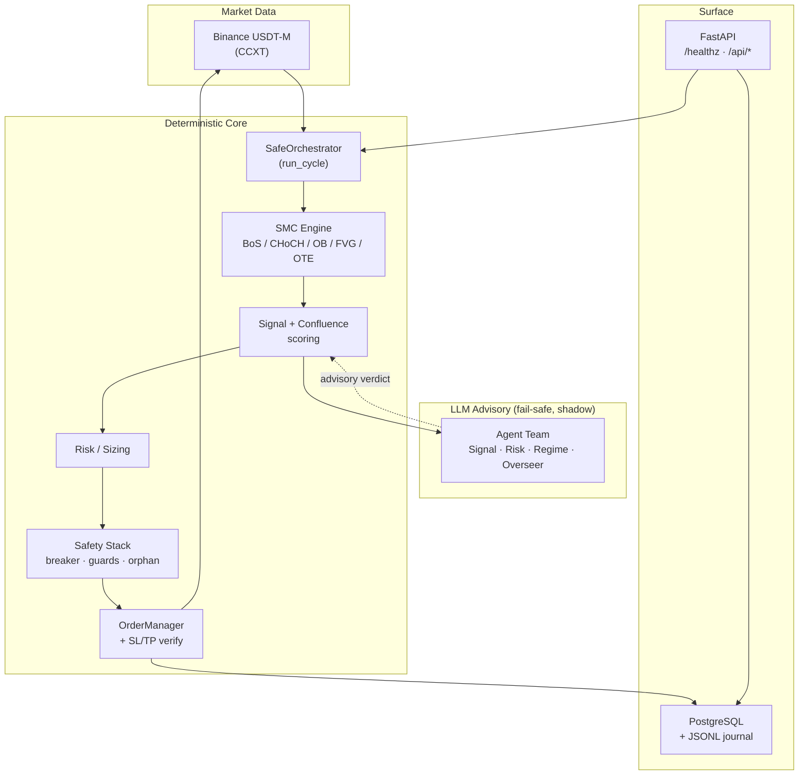
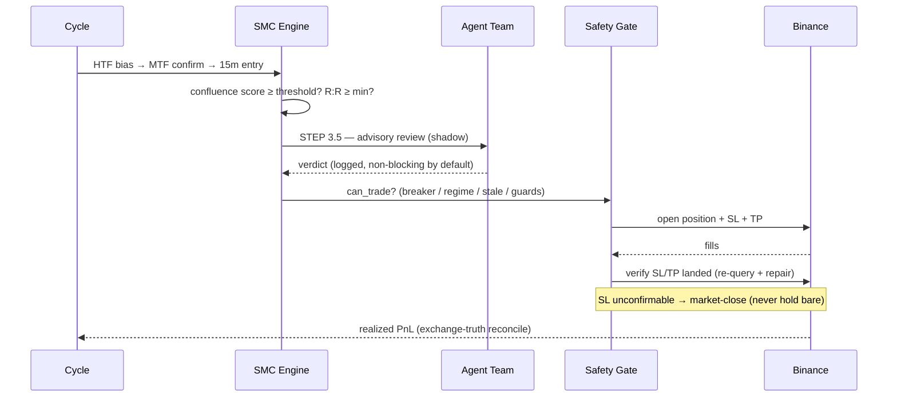
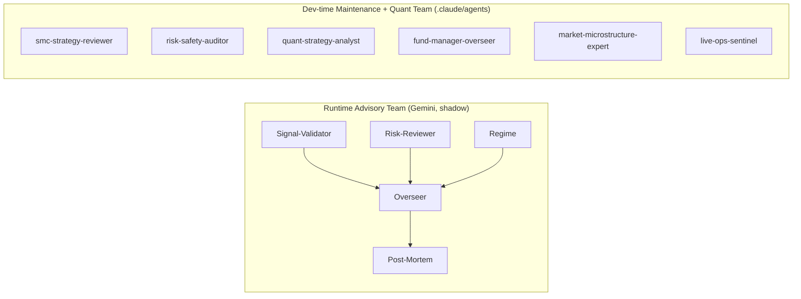

<p align="center">
  
</p>

<p align="center">
  
  
  
  
  
  
</p>

<p align="center"><b>Institutional-grade Smart Money Concepts trading bot for Binance USDT-M Futures — with a deterministic, multi-layer safety engine and a fail-safe LLM advisory team.</b></p>

---

## ✨ Overview

**Efloud Bot** is an automated futures trading system built around **Smart Money Concepts (SMC)** — Break of Structure (BoS), Change of Character (CHoCH), Order Blocks (OB), Fair Value Gaps (FVG) and Optimal Trade Entry (OTE) — across a multi-timeframe chain (4h bias → 1h confirmation → 15m entry).

What sets it apart is **not** the signals; it is the **discipline around them**:

- A **deterministic 7-layer safety engine** (circuit breaker, position guards, orphan protection, reverse-on-profit guard, entry-drift guard, flat-book preflight, margin isolation) that gates every order.
- An **exchange-truth reconciliation** layer — realized PnL is read from Binance income (`realizedPnl − commission − funding`), never trusted from local estimates.
- A **fail-safe multi-agent LLM layer** that *advises* but never overrides the deterministic guards. No API key → the bot runs unchanged.

> ⚠️ **Risk disclaimer.** This software trades real money on leveraged derivatives. Futures trading can lead to **total loss of capital**. Nothing here is financial advice. Run on testnet first; use at your own risk.

---

## 🏗 Architecture



The agent team sits **beside** the pipeline as an advisor. The trade decision always flows through the deterministic `can_trade` gate and the safety stack — the LLM layer can be disabled at any time with zero behavioural change.

---

## 🔁 Trade Lifecycle



---

## 🛡 The Safety Stack

| Layer | What it does |
|---|---|
| **Circuit Breaker** | Daily / weekly loss limits + consecutive-loss pause → HALT |
| **Position Guards** | Per-trade notional cap, total exposure cap, SL-distance bounds, max holding, pyramid cap |
| **Orphan Protection** | Detects exchange positions unknown to local state; can place protective SL |
| **Reverse-on-Profit Guard** | Blocks flip into an opposite signal unless current position is in profit beyond a fee/slippage buffer |
| **Entry-Drift Guard** | Rejects entries where live price has drifted past the signal anchor (or already passed TP1) |
| **SL/TP Post-Placement Verify** | Re-queries after entry; repairs missing legs; market-closes if SL can't be confirmed |
| **Margin Isolation + One-Way** | ISOLATED margin + one-way mode enforced at startup; flat-book preflight `[5/5]` gate before any mode change |

Every layer **fails safe**: the worst outcome of a misconfiguration is an *aborted startup* (no trading), never an unguarded live position.

---

## 🤖 Agent System

Two independent layers, both **additive and fail-safe**:



- **Runtime team** (`engine/agents/`) reviews every signal in **shadow mode** (`gating: false`). Verdicts are logged to `state/agent_disagreements.jsonl` and surfaced at `GET /api/ai/agents`. With no `GEMINI_API_KEY`, every agent returns `NEUTRAL` and the bot is unaffected.
- **Dev-time team** (`.claude/agents/`) is a panel of specialists for code maintenance **and** trading expertise — from SMC review and risk auditing to a fund-manager-grade portfolio overseer and a live-ops sentinel. All are **advisory**; none can weaken the deterministic guards or flip gating.

---

## 🧰 Tech Stack

`Python 3.11` · `CCXT` · `pandas` / `numpy` · `FastAPI` + `uvicorn` · `asyncpg` (PostgreSQL) · `pytest` (1261 tests) · `anthropic` / Gemini (advisory) · Docker / Railway · GitHub Actions CI.

---

## 🚀 Quick Start

```bash
# 1. Install
python -m venv .venv && source .venv/bin/activate
pip install -r requirements.txt

# 2. Configure (testnet first!)
cp .env.example .env          # set BINANCE_API_KEY / SECRET
# edit config.yaml: testnet: true, dry_run: true

# 3. Run
python main.py                # CLI (reads config.yaml)

# 4. Dashboard / API
uvicorn backend.api:app --reload   # /healthz, /api/*
```

> **Going live** requires `EFLOUD_ALLOW_MAINNET=1` and a passing pre-flight:
> `EFLOUD_ALLOW_MAINNET=1 EFLOUD_CONFIG_PATH=configs/config.phase2_1k.yaml python preflight.py` → `[5/5]` must pass on a **flat book**.

---

## ⚙️ Configuration

- `config.yaml` — CLI default profile.
- `configs/config.phase2_1k.yaml` — **production-active** profile (FastAPI/Railway reads this via `EFLOUD_CONFIG_PATH`).
- Key blocks: `exchange` (margin/leverage/mode), `risk`, `safety` (the stack above), `agent_team` (advisory LLM; `gating: false` by default).

---

## ✅ Testing & CI

```bash
python -m pytest -q              # full suite (1261 passed)
```

GitHub Actions runs the whole suite on every PR (Python 3.11, hermetic — no secrets, agent layer falls back to NEUTRAL). CI is a hard gate: claims of “tests pass” are re-verified on the actual pushed commit.

---

## 📦 Deployment

Containerised (`Dockerfile`) and deployed on **Railway** (`/healthz` healthcheck, restart-on-failure). Live margin/mode changes follow a **flat-book maintenance-window runbook** (stop → flatten → deploy → preflight `[5/5]` → start → confirm).

---

## 🗂 Project Structure

```
engine/            SMC core, orchestrator, safety/, risk/, regimes/, agents/
exchange/          CCXT client + OrderManager (entry, SL/TP, reconcile, PnL)
backend/           FastAPI app, bot_runner, db, tests/
preflight.py       mainnet readiness + flat-book gate
config.yaml        default profile   · configs/   production profiles
.claude/agents/    dev-time maintenance + quant agent team
.github/workflows/ CI
```

---

## 🗺 Roadmap

- 2-pass risk review (post-sizing notional) · gating arbitration (score / majority) · shadow-data correlation report
- CI hermeticity (mock live-exchange tests) · expanded backtest analytics
- Quant agent team: portfolio-level allocation + correlation-aware sizing

---

## 💛 Sponsorship

Efloud Bot is privately developed. Sponsorship / collaboration enquiries are welcome — please open a discussion or contact the maintainer. _(Public GitHub Sponsors can be enabled later; this repository is currently private.)_

---

## 📄 License

Proprietary — all rights reserved. Not for redistribution. **Trading involves substantial risk of loss.**
