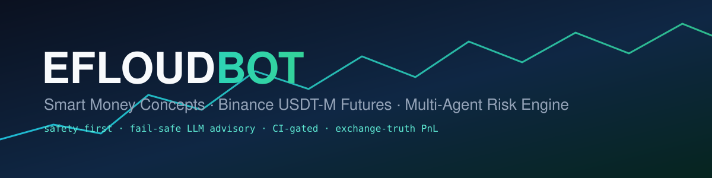
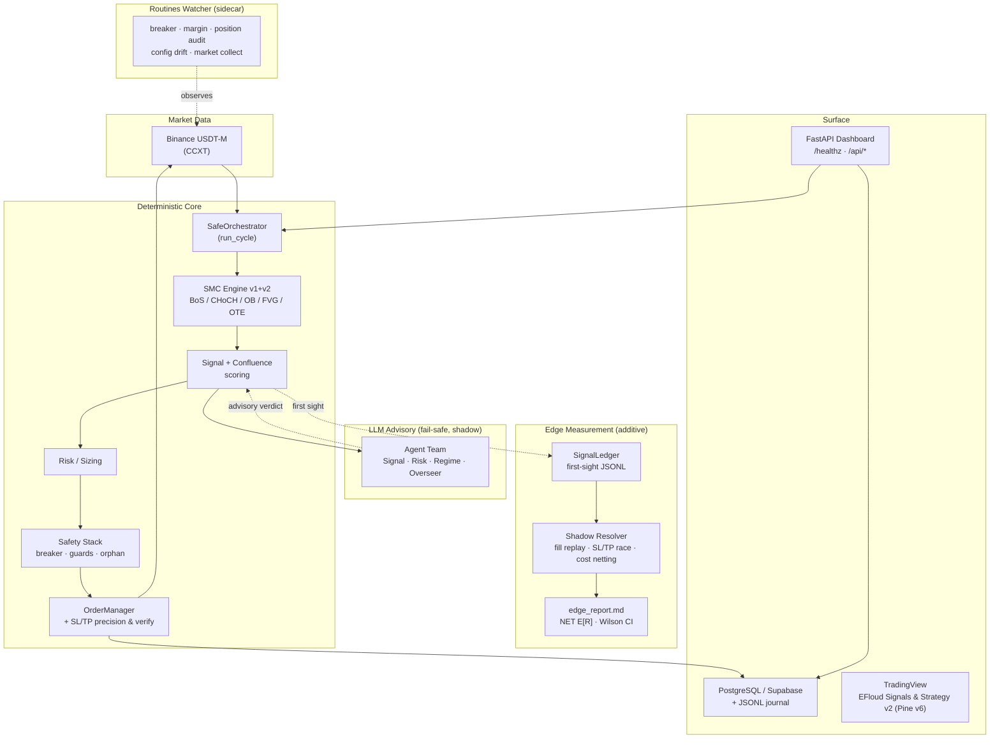
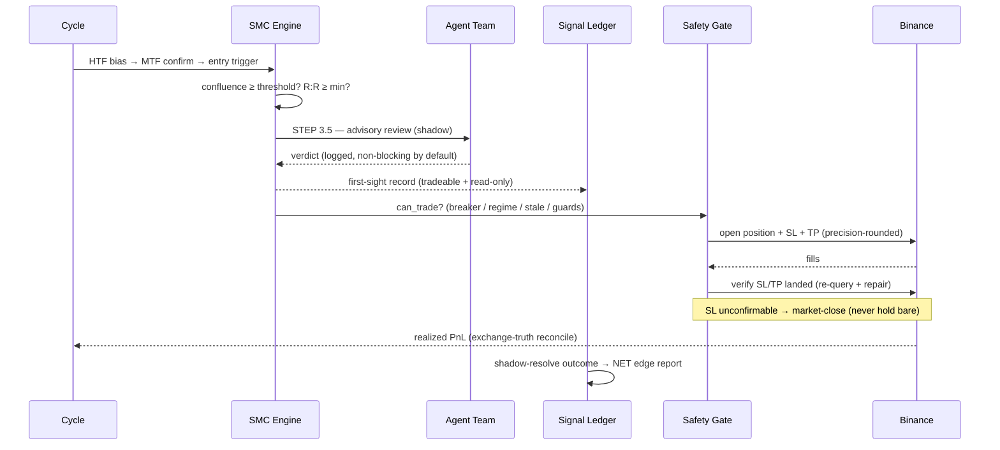

<p align="center">
  
</p>

<p align="center">
  <a href="README.md">🇬🇧 English</a> ·
  <a href="README.tr.md">🇹🇷 Türkçe</a> ·
  <a href="README.ru.md">🇷🇺 Русский</a>
</p>

<p align="center">
  
  
  
  
  
  
  
</p>

<p align="center"><b>Institutional-grade Smart Money Concepts trading system for Binance USDT-M Futures — a deterministic multi-layer safety engine, live NET-cost edge measurement, companion TradingView indicators, and a fail-safe LLM advisory team.</b></p>

---

## ✨ Overview

**Efloud Bot** is an automated futures trading system built around **Smart Money Concepts (SMC)** — Break of Structure (BoS), Change of Character (CHoCH), Order Blocks (OB), Fair Value Gaps (FVG) and Optimal Trade Entry (OTE) — across a multi-timeframe chain (HTF bias → MTF confirmation → entry-TF trigger).

What sets it apart is **not** the signals; it is the **discipline around them**:

- A **deterministic 7-layer safety engine** (circuit breaker, position guards, orphan protection, reverse-on-profit guard, fail-closed entry-drift guard, flat-book preflight, margin isolation) that gates every order.
- **Exchange-truth reconciliation** — realized PnL is read from Binance income (`realizedPnl − commission − funding`), never trusted from local estimates.
- A built-in **Live Edge Measurement Core** — every signal is recorded first-sight, shadow-resolved against real market data, and reported as **cost-netted, significance-gated** edge metrics. The bot measures its own edge honestly, in production.
- A **24/7 monitoring sidecar** (routines watcher) — circuit-breaker watch, margin watch, position audit, config-drift detection and market collection run on their own cadences, independent of the trading loop.
- **Companion TradingView indicators** (Pine v6) — the same SMC state machine, chart-ready and non-repainting, for discretionary confirmation or standalone use.
- A **fail-safe multi-agent LLM layer** that *advises* but never overrides the deterministic guards. No API key → the bot runs unchanged.

> ⚠️ **Risk disclaimer.** This software trades real money on leveraged derivatives. Futures trading can lead to **total loss of capital**. Nothing here is financial advice. Run on testnet first; use at your own risk.

---

## 🏗 Architecture



The agent team sits **beside** the pipeline as an advisor. The trade decision always flows through the deterministic `can_trade` gate and the safety stack — the LLM layer can be disabled at any time with zero behavioural change. The edge-measurement layer is **read-only and default-OFF** (`signal_ledger.enabled` / `EFLOUD_SIGNAL_LEDGER_ENABLED`): it observes, it never touches orders.

---

## 🔁 Trade Lifecycle



---

## 🛡 The Safety Stack

| Layer | What it does |
|---|---|
| **Circuit Breaker** | Daily / weekly loss limits + consecutive-loss pause → HALT (persisted across restarts) |
| **Position Guards** | Per-trade notional cap, total exposure cap, SL-distance bounds (optional hard reject above max ATR), max holding, pyramid cap |
| **Orphan Protection** | Detects exchange positions unknown to local state; can place protective SL |
| **Reverse-on-Profit Guard** | Blocks flip into an opposite signal unless the current position is in profit beyond a fee/slippage buffer |
| **Entry-Drift Guard (fail-closed)** | Rejects entries where live price drifted past the signal anchor or already passed TP1 — and **blocks the entry when the price feed itself fails** |
| **SL/TP Precision + Post-Placement Verify** | Prices rounded via exchange precision rules (no PRICE_FILTER rejects); re-queries after entry; repairs missing legs; market-closes if SL can't be confirmed |
| **Margin Isolation + One-Way** | ISOLATED margin + one-way mode enforced at startup; flat-book preflight `[5/5]` gate before any mode change |
| **V2 Shadow Fail-Closed** | The next-gen SMC v2 engine defaults to shadow mode — a dropped config key keeps it *observing*, never trading |

Every layer **fails safe**: the worst outcome of a misconfiguration is an *aborted startup* (no trading), never an unguarded live position.

---

## 📏 Live Edge Measurement

The question every bot vendor avoids: *does the signal actually carry a tradeable edge after costs?* Efloud Bot answers it about itself, continuously:

- **SignalLedger** — every first-sight signal (tradeable *and* read-only) is appended to an idempotent JSONL ledger at the moment of confirmation.
- **Shadow Resolver** (5-min cadence) — replays the hypothetical fill (market-at-confirmation), races SL vs TP on 1-minute data with conservative same-bar=SL handling, and nets out **fees + funding + slippage** in R-units.
- **Edge Report** (hourly) — NET expectancy, win-rate with Wilson confidence intervals, profit factor, timeout-robustness panel, per-dimension breakdowns — with honest `INSUFFICIENT EVIDENCE` gating until the sample is large enough.

Everything is flag-gated (`signal_ledger.enabled: false` by default) and read-only. Calibration decisions (confluence thresholds, TP models) are made from this data, not from vibes.

---

## 📈 TradingView Companion (Pine v6)

Two chart-ready scripts mirror the bot's SMC v2 logic — **EFloud Signals v2** (indicator) and **EFloud Strategy v2** (backtest):

- Full **wait-confirm state machine**: CHoCH trigger → pullback zone (FVG > OB > OTE) → engulfing confirmation.
- **0–100 confluence scoring** (MTF CHoCH, HTF FVG, Order Block retest, OTE, SFP, premium/discount, daily bias, AI-sentiment input) with an optional gate.
- **Non-repainting by construction** — all higher-TF data uses the last *closed* bar (`[1]`-shift + `lookahead_on`), so live signals match backtest.
- Trade-horizon profiles (scalp / mid / long), volatility-aligned SL buffer, TP1/TP2 ladder, on-chart dashboard and wrong-timeframe warning.

Sources live in [`pine/`](pine/) with the full translation spec in [`pine/PINE_SPEC.md`](pine/PINE_SPEC.md).

---

## 🤖 Agent System

Two independent layers, both **additive and fail-safe**:

- **Runtime team** (`engine/agents/`) reviews every signal in **shadow mode** (`gating: false`). Verdicts are logged and surfaced at `GET /api/ai/agents`. With no `GEMINI_API_KEY`, every agent returns `NEUTRAL` and the bot is unaffected; a *failed* (as opposed to unconfigured) agent returns `ERROR` and the team **fails closed**.
- **Dev-time team** (`.claude/agents/`) is a panel of specialists for code maintenance **and** trading expertise — SMC review, risk auditing, quant analysis, a fund-manager-grade overseer and a live-ops sentinel. All are **advisory**; none can weaken the deterministic guards.

---

## 🧰 Tech Stack

`Python 3.11` · `CCXT` · `pandas` / `numpy` · `FastAPI` + `uvicorn` · `asyncpg` (PostgreSQL / Supabase) · `pytest` (**2,000+ tests**) · Pine Script v6 · Gemini / Anthropic (advisory only) · Docker Compose · Caddy (TLS) · GitHub Actions CI.

---

## 🚀 Quick Start

```bash
# 1. Install
python -m venv .venv && source .venv/bin/activate
pip install -r requirements.txt

# 2. Configure (testnet first!)
cp .env.example .env          # set BINANCE_API_KEY / SECRET
# edit config.yaml: testnet: true, dry_run: true

# 3. Run
python main.py                # CLI (reads config.yaml)

# 4. Dashboard / API
uvicorn backend.main:app --reload   # /healthz, /api/*, web dashboard

# 5. Monitoring sidecar (optional, recommended)
python -m scripts.routines.runner watch
```

> **Going live** requires `EFLOUD_ALLOW_MAINNET=1` and a passing pre-flight:
> `EFLOUD_ALLOW_MAINNET=1 EFLOUD_CONFIG_PATH=configs/config.phase2_1k.yaml python preflight.py` → `[5/5]` must pass on a **flat book**.

---

## ⚙️ Configuration

- `config.yaml` — CLI default profile.
- `configs/config.phase2_1k.yaml` — **production-active** profile (the backend reads this via `EFLOUD_CONFIG_PATH`).
- `configs/config.phase2_long_1k.yaml` — second-instance profile (multi-bot deployments).
- Key blocks: `exchange` (margin/leverage/mode), `risk`, `safety` (the stack above), `smc_v2` (shadow-gated v2 engine), `signal_ledger` (edge measurement, default OFF — activate in prod via `EFLOUD_SIGNAL_LEDGER_ENABLED=1`), `agent_team` (advisory LLM; `gating: false` by default).

---

## ✅ Testing & CI

```bash
python -m pytest -q              # full suite (2,000+ passing)
```

GitHub Actions runs the whole suite on every PR (Python 3.11, hermetic — no secrets, agent layer falls back to NEUTRAL). CI is a hard gate: claims of "tests pass" are re-verified on the actual pushed commit. Trade-logic changes additionally require a **NET-cost backtest / edge gate** before merge.

---

## 📦 Deployment

Containerised multi-service **Docker Compose** stack, production-proven on a Hetzner VPS behind **Caddy** (automatic TLS):

| Service | Role |
|---|---|
| `efloud-bot` | V1 trading instance + FastAPI dashboard |
| `efloud-bot-long` | second instance (own wallet, own config/env) |
| `routines-watcher` | 24/7 monitoring + edge resolver/report |
| `alerter` / `overseer` / `daily-report` | log-tail alerting, supervision, reporting |
| `caddy` | TLS reverse proxy for the dashboards |

Live margin/mode changes follow a **flat-book maintenance-window runbook** (stop → flatten → deploy → preflight `[5/5]` → start → confirm). See [`deploy/HETZNER_GUIDE.md`](deploy/HETZNER_GUIDE.md) and [`docs/deployment_guide.md`](docs/deployment_guide.md).

---

## 🗂 Project Structure

```
engine/            SMC core (v1 + smc_v2/), orchestrator, safety/, risk/, agents/,
                   signal_ledger, edge_costs, edge_metrics
exchange/          CCXT client + OrderManager (entry, SL/TP precision+verify, reconcile, PnL)
backend/           FastAPI app, bot_runner, db, tests/
scripts/routines/  monitoring sidecar: breaker/margin/position audit, resolver, edge report
pine/              TradingView Pine v6 — EFloud Signals & Strategy v2 (+ PINE_SPEC.md)
preflight.py       mainnet readiness + flat-book gate
configs/           production profiles  ·  config.yaml  default profile
deploy/            docker-compose.prod.yml assets, Caddyfile, guides
.claude/agents/    dev-time maintenance + quant agent team
.github/workflows/ CI
```

---

## 🗺 Roadmap

- **Edge-driven calibration** — confluence-threshold sweep and TP-model decisions from live NET-cost data (scheduled).
- Correlation-aware position sizing (flag-gated, backtest-gated).
- Expanded backtest analytics · gating arbitration (score / majority) for the advisory team.
- Productisation: packaged onboarding, per-customer instances, licensing.

---

## 💼 Commercial

Efloud Bot is privately developed and **moving toward commercial availability** (managed instances / licensing). For early access, partnership or licensing enquiries, contact the maintainer or open a discussion. The TradingView indicator ships separately.

---

## 📄 License

Proprietary — all rights reserved. Not for redistribution. **Trading involves substantial risk of loss; past performance does not guarantee future results.**
