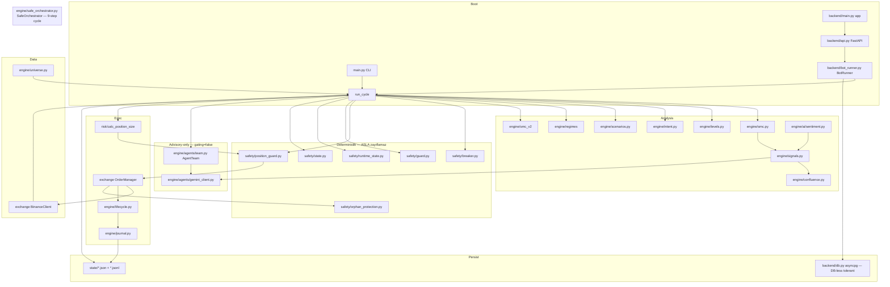
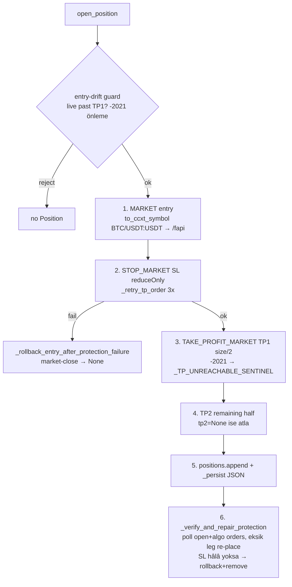

# 01 — Repo Map & Architecture (efloud-bot)

> Phase 1 deliverable. Source: 3 paralel read-only Explore subagent (engine / exchange+backend / ops+config). Tüm dosya:satır referansları koddan doğrulandı.
> Tarih: 2026-06-02. Branch hedefi: `audit/codebase-and-strategy-review`.

---

## 0. Tek-bakışta sistem

efloud-bot = **Python crypto-futures trading botu** (Binance USD-M). Tek process içinde
hem FastAPI dashboard hem trading daemon çalışır (prod). Çekirdek: 4-timeframe Smart
Money Concepts + confluence skorlama → deterministik safety stack → CCXT order
yönetimi → reconcile/journal. Üstüne **advisory-only** LLM agent katmanı (shadow).

**İki çalışma yolu (DIVERGENCE — kritik):**
- **Prod:** `uvicorn backend.main:app` → `backend/bot_runner.py:BotRunner` daemon → DB yazımı, healthz, WebSocket, crash-loop suspend. Config: `EFLOUD_CONFIG_PATH=configs/config.phase2_1k.yaml`.
- **CLI:** `python main.py [config.yaml]` → DB YOK, healthz YOK, WS YOK, crash-loop guard YOK. Config default: kök `config.yaml`.
- ⚠️ Aynı analiz çekirdeği (SafeOrchestrator), farklı bootstrap. SMC v2 wiring (`_build_setup_state_store`) başta sadece `main.py`'deydi; `bot_runner.py`'ye hotfix ile eklendi (PR #S6) — aksi halde prod'da v2 hiç aktive olmuyordu. **Bu sınıf divergence Phase 2'de taranacak.**

---

## 1. Üst-seviye dizin ağacı

```
efloud-bot/
├── main.py (707)              CLI entrypoint (load→validate→guard→client→orch→loop)
├── preflight.py               Pre-deploy read-only API check (no orders)
├── config.yaml                CLI default template (testnet, dry_run=true) — prod OKUMAZ
├── engine/                    Analiz + safety çekirdeği (aşağıda detay)
├── exchange/ (__init__ 1981)  BinanceClient + OrderManager + Position
│   ├── adapter.py             ExchangeAdapter Protocol (broker-agnostic)
│   ├── mt5.py / oanda.py      Forex adapter stub'ları
├── backend/                   FastAPI servisi (prod)
│   ├── main.py / api.py / auth.py / bot_runner.py / db.py / healthz.py
│   ├── migrate.py + migrations/ (001..010)
│   ├── audit/ social/ notifications/ events.py ws.py pubsub_consumer.py
├── risk/__init__.py (49)      calc_position_size — PRIMARY sizer
├── backtest/                  Walk-forward harness (engine, cli, slippage, funding, grid, metrics, intrabar, comparison, reproducibility)
├── ops/                       Sidecar'lar: overseer/ alerter/ daily_report/
├── scripts/                   Backtest runner'lar, supabase, autoresearch, diag
├── configs/                   ÇOK SAYIDA yaml (phase2_1k=PROD, aggressive_v1, testnet, h1c, h2a2, archive/)
├── .claude/                   9 agent + 6+ skill + settings(.local).json
├── .mcp.json                  github MCP (tek)
└── root *.md                  AGENTS, CLAUDE(.original/.python), HERMES(.original), GEMINI, RISK_MAP, PR_BODY, MAINNET_GECIS_REHBERI, README
```

### engine/ alt-ağacı (satır sayıları)
```
engine/
├── safe_orchestrator.py (1700)  *** ÇEKIRDEK orkestratör — 9 adımlı cycle ***
├── smc.py (385)                 SMC detection (swing/CHoCH/BOS/FVG/OB/SFP/range/OTE)
├── signals.py (711)             4-TF signal generator + Gemini validation
├── confluence.py (47)           Pure scoring fn (9 bool → 0-100)
├── intent.py (215)              Conviction/"istekli hareket" skoru + weakness exit
├── levels.py (214)              MO/WO/DO/PWO/PMO/PDO + Monday H/L + stacked zones
├── scenarios.py (418)           3-senaryo (main/invalidation/plan-B) planlayıcı
├── lifecycle.py (513)           Position state machine (TP1→%50 partial+BE, TP2→full)
├── journal.py (256)             JSONL trade log + idempotent PnL reconcile
├── memory.py (155)              Error-pattern aggregator (short/long window)
├── adaptive.py (216)            Self-tuning param engine (memory→config mutation)
├── postmortem.py (276)          Post-trade error tagging
├── report.py (233)              Markdown cycle report
├── universe.py (174)            Symbol watchlist (fixed/dynamic/hybrid)
├── safety/
│   ├── breaker.py (312)         Circuit breaker (daily/weekly/consec/emergency, HALTED persist)
│   ├── guard.py (237)           retry/backoff, RateLimiter, kline freshness/integrity, MainnetGuard
│   ├── position_guard.py (474)  7-kural per-position (notional, exposure, dup/opposite, SL-ATR, %5 cap, reverse)
│   ├── state.py (192)           Atomic JSON persist (tmp→fsync→rename) + reconcile_positions
│   ├── runtime_state.py (194)   Liveness/ping/fatal/crash-loop
│   └── orphan_protection.py (250) Exchange-side orphan SL placer (default warn_only)
├── risk/custom_calculator.py (117)  reverse_from_risk alternatif sizer
├── regimes/ (__init__ 264, model 94, train 94)  ADX/BB/ATR → TRENDING/RANGING/VOLATILE/REVERSAL + NumPy ML ensemble
├── smc_v2/ (zones, confirmation, triggers, setup_state, swing_anchor, sl_calc, tp_calc, exceptions)
├── agents/ (base, gemini_client, roles 5x, team)  Advisory LLM team
├── ai/sentiment.py (120)        Fear&Greed + Gemini macro → ±5 confluence bonus
├── notifications/ permissions/
```

---

## 2. Modül bağımlılık grafiği (yüksek seviye)



**Tasarım gücü:** Backtest (`backtest/engine.py`) **canlı SafeOrchestrator'ı yeniden kullanır** — ayrı strateji reimplementasyonu yok → live/backtest divergence yapısal olarak minimize.

---

## 3. Karar akışı — sinyal → emir (SafeOrchestrator.run_cycle 9 adım)

```mermaid
sequenceDiagram
  participant Data as BinanceClient (1d/4h/1h/15m)
  participant SO as SafeOrchestrator.run_cycle
  participant BRK as CircuitBreaker
  participant REG as RegimeDetector
  participant SIG as generate_signals
  participant TEAM as AgentTeam (advisory)
  participant PG as PositionGuard
  participant OM as OrderManager
  participant LC as PositionLifecycle

  Data->>SO: 4 DataFrame
  SO->>SO: 0a v2 setup-state advance; 0b kline freshness/integrity (StaleDataError)
  SO->>BRK: 1. check(now) → OPEN/TRIPPED/HALTED
  SO->>REG: 2. analyze → can_open_new_position; should_tighten_stops mutate SL
  SO->>SIG: 3. SMC+levels+intent+confluence+ATR SL/TP + Gemini validate
  SO->>SO: 4. scenarios; 5. lifecycle.on_tick (SL/TP1/TP2, weakness) → breaker.record_trade
  Note over SO: 6. can_trade = breaker.can_trade AND not stale AND regime.can_open AND not watch_only
  SO->>TEAM: review_trade(ctx)  [advisory; gating=true ise REJECT veto]
  SO->>PG: sizing(risk/) + can_open_position (7 kural) + reverse check
  PG->>OM: open_position(...)
  OM->>LC: open_position (local state) → journal entry
  SO->>SO: 7. pyramid adds; 8. persist; 9. report → SafeCycleResult
```

**Çağrı zinciri (dosya:satır):**
- `run_cycle` (safe_orchestrator.py:577) → `generate_signals` (signals.py:257) → `SMCEngine.analyze` (smc.py:358), `calc_confluence` (confluence.py:6), `validate_signal_with_gemini` (signals.py:167) → `GeminiClient.complete_json` (agents/gemini_client.py:58)
- Gate'ler: `CircuitBreaker.check` (breaker.py:132), `RegimeDetector.analyze` (regimes/__init__.py:95), `PositionGuard.can_open_position` (position_guard.py:205)
- Guard sonrası: `OrderManager.open_position` (exchange/__init__.py) → `PositionLifecycle.open_position` (lifecycle.py:256)

---

## 4. Order lifecycle (exchange/__init__.py OrderManager)



**Reconcile (her ~30s, `bot_runner._run_loop` → executor):**
- `fetch_positions` + `fetch_open_orders` + `fapiPrivateGetOpenAlgoOrders` → BN order ids
- Pozisyon BN'de yoksa → `_estimate_exit_price` → `_cancel_position_siblings` → `_record_close` (`fetch_realized_pnl` Binance income endpoint, exchange-truth) → journal close
- TP1 order id kayıpsa → `tp1_hit=True` + `_move_sl_to_breakeven`
- `_repair_missing_protection_orders` (SL→TP1→TP2 öncelik), orphan order sweeper, her 20 cycle `_maybe_run_pnl_audit`

**Margin/mode setup (`BotRunner.start` / `main()`):** `_enforce_margin_setup` →
`set_margin_mode ISOLATED` (GET-first, fail=FATAL), `set_leverage 5` (fail=non-fatal),
`set_position_mode one-way` (GET-first, fail=FATAL). Prod: ISOLATED + one-way + 5x.

---

## 5. FastAPI yüzeyi (backend/api.py, prefix `/api`, cookie auth)

| Endpoint | Method | Auth | İş |
|---|---|---|---|
| /api/login, /logout | POST | (login No) | itsdangerous signed cookie, rate-limit 5/15min |
| /api/status, /positions, /orders, /history, /equity | GET | Yes | snapshot, BN+bot meta, DB→JSONL fallback |
| /api/bot/start \| stop \| restart | POST | Yes | runner kontrol |
| /api/kill-switch, /breaker/reset | POST | Yes | OM kill + breaker `_halt` / `manual_reset` + DB audit |
| /api/config | GET | Yes | sanitized (secret yok) |
| /api/social/* | GET | Yes | feeds/doctrine/hypotheses (Learning Center) |
| /api/market/funding-rates, /open-interest | GET | Yes | BN premiumIndex / OI history (DASHBOARD'da var ama STRATEJIYE girmiyor — Phase 3 notu) |
| /api/ai/sentiment, /agents, /post-mortem | GET/POST | Yes | sentiment registry, AgentTeam.recent_reviews, post-mortem |
| /healthz | GET | No | crash-loop/HALTED → 200 suspended (autoheal loop önleme) |
| /ws | WS | cookie | events.bus stream |

---

## 6. Persistence

- **DB (asyncpg, opsiyonel):** `trades`, `trade_audits`, `equity_history`, `audit_log`, `breaker_state`(010), `schema_migrations`. En yüksek migration: **010**. Prod **DB-LESS** çalışır (`DATABASE_URL` yok → `pool=None`, tüm metotlar guard'lı no-op). DB sadece observability/dashboard.
- **File (crash-recovery birincil):** `order_manager_positions.json` (tüm order id'ler), `trade_journal.jsonl` (close append + API fallback), `ai_sentiment_registry.json`, `setup_candidates.json` (v2), breaker StateStore.

---

## 7. agents/ advisory katmanı (gating=false shadow)

```
AgentTeam (engine/agents/team.py:53)
├─ enabled:false (default) → no-op, NEUTRAL
├─ enabled:true, gating:false → bilgilendirici (PROD bu)
└─ enabled:true, gating:true → REJECT hard veto

Akış: SignalValidator + RiskReviewer + RegimeAgent → OverseerAgent (sadece alt-verdict'leri görür)
Gating kararı: safe_orchestrator.py:859-873  (_agent_veto = gating AND verdict==REJECT)
GeminiClient (gemini_client.py): tek shared client, hata→{} (fail-safe), model="gemini-3.5-flash" ⚠️
Log: state/agent_disagreements.jsonl
```
Breaker/PositionGuard/orphan katmanları bu veto'dan **tamamen bağımsız**.

---

## 8. Modül özet tablosu (amaç/girdi/çıktı/sorumluluk) — kısalt

| Modül | Amaç | Girdi | Çıktı | Sorumluluk |
|---|---|---|---|---|
| safe_orchestrator | Üst orkestratör | config, 4 DF, balance | SafeCycleResult | 9-step cycle, tüm alt-engine sahibi |
| smc | SMC detection | OHLCV | swing/CHoCH/FVG/OB/SFP/range/OTE | Market structure primitifleri |
| signals | 4-TF signal | DF'ler + sentiment | List[Signal] | confluence + ATR SL/TP + Gemini validate |
| confluence | Skor | 9 bool | (score, reasons) | Pure, sabit ağırlık |
| breaker | Circuit breaker | record_trade/check | OPEN/TRIPPED/HALTED | daily/weekly/consec/emergency + HALTED persist |
| position_guard | Per-pos kural | balance/entry/size/sl | allow+reason | notional/exposure/dup/SL-ATR/%5/reverse |
| orphan_protection | Orphan SL | BN positions | ProtectionAction | exchange-only pos'a SL koy (default off) |
| lifecycle | Pos state machine | symbol/dir/price/sl/tp | Position/Entry/Exit | TP1 partial+BE, TP2 full, weakness |
| OrderManager | Emir yaşam döngüsü | BinanceClient | Position | open/SL/TP/verify/reconcile/kill |
| regimes | Rejim | OHLCV | RegimeAnalysis | ADX/BB/ATR + ML ensemble |
| risk/calc_position_size | Sizer | balance/risk/sl | contracts | risk-based + notional cap |
| AgentTeam | Advisory | ctx | team_verdict | 5 rol → overseer (gating=false) |
| journal | Trade log | snapshot | jsonl | entry/exit + PnL reconcile idempotent |

---

## 9. Phase 2'ye köprü — doğrulanacak RED FLAG tohumları

`00_journal.md` "RED FLAG tohumları" bölümüne bak. En kritik 3'ü:
1. **`gemini-3.5-flash` geçersiz model** (4 dosya) → advisory + sentiment + Gemini-signal-validation pratikte hep `{}`. LLM edge **ölçülemez/aktif değil**.
2. **`record_trade_close` trace_id'siz eşleme** (db.py) → hızlı aynı-sembol open/close yanlış satır kapatabilir.
3. **`_reported_to_breaker` persist edilmiyor** → restart'ta breaker PnL çift-sayım riski (geçmiş incident sınıfı).

> Sıradaki: Phase 2 — risk-safety-auditor + smc-strategy-reviewer + agent-team-engineer paralel; her bulgu severity + dosya:satır + kanıt + somut fix/test ile `02_findings.md`.
