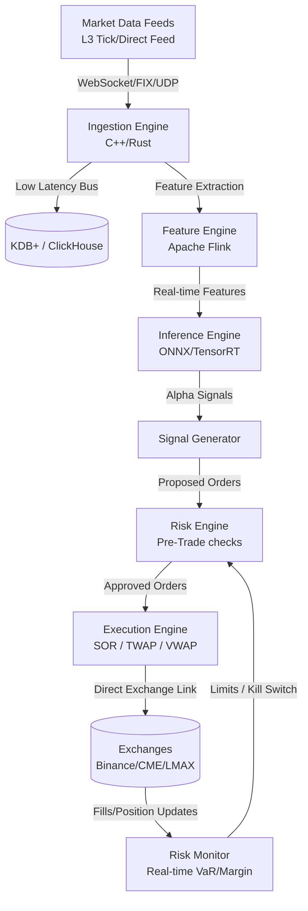

# Next-Session Work & Business Plan — Frontend / Marketing / SEO + u2algo.com Rebuild

> **Tarih:** 2026-06-20
> **Üreten:** Claude (Opus 4.8) — bu bir SEED/handoff dokümanıdır, sonraki konuşmada `/brainstorming` ile açılacak.
> **Önceki iş:** `feat/audit-remediation` @ `c0d6c60` → **PR #232** (algoritma audit remediation, 9 fix default-OFF/fail-closed, dual-review APPROVE, merge operatör sign-off'a gated). Bu doküman o iş BİTTİKTEN sonraki yön.
> **Standing dev-contract:** Karpathy 4 prensip (`CLAUDE.md` → "Geliştirme Sözleşmesi"). Bu planın HER fix'i o sözleşmeye uyar.

---

## 0. Bu Dokümanı Nasıl Kullan

Bu plan **3 işi tek oturuma sıkıştırmaz**. Sonraki konuşma şu sırayla açılır:

1. `/brainstorming` → aşağıdaki **§2 Açık Kararlar**'ı operatörle netleştir (premium tanımı, u2algo.com stack, hedef pazar, bütçe/scope). Bunlar netleşmeden kod/tasarım YOK.
2. `/ultrareview` (veya Workflow) → **Track A** (bot feature & ops review) — bu doküman §3'teki kurumsal audit'i doğrula + ölçeğe-uygun roadmap üret.
3. Track B/C/D (frontend → marketing/SEO → u2algo.com rebuild) — netleşen kararlara göre sıralı faz.

**Kritik dürüstlük kısıtı (her track'i bağlar):** Bot'un **kanıtlanmış canlı edge'i YOK** (Wave-2 redesign FALSIFIED, canlı proof −%5.3; indicator-only ship final ürün). Satış sitesi "kârlı bot" iddiası KURAMAZ — `free + waitlist` + `research-log/transparency` çerçevesi operatör kararıdır (P-002). Bkz. memory `wave2_dropped_falsification`, `p002_marketing_growth`, ve #221 honesty fix.

---

## 1. Mevcut Durum Snapshot (post PR #232)

| Alan | Durum |
|------|-------|
| Bot çekirdeği | Python live mainnet, SMC + confluence scoring, ~$2070 gerçek Binance Futures cüzdanı. RUNNING. |
| Son remediation | PR #232: C1/C3/H2/H3/H4/M3/M4 + D1/D2 + Karpathy contract. 9 fix default-OFF/fail-closed. 1664 test pass. **Merge operatör-gated.** |
| Parked (backtest-gated) | C4/H1/H5/H6/H7/M1/M2 edge bulguları — NET-cost backtest gate (Edge Measurement Core, PR #227) bekliyor. |
| Ürün | Indicator-only ship FINAL (Pine `pine/efloud_signals.pine` + Wave-1). Premium strateji DROP. |
| Site (mevcut) | `u2algo-site` Next.js 15/Node 20, Railway `considerate-intuition` → `https://u2algo-site-production.up.railway.app`. Supabase REST waitlist + JSONL fallback. |
| Dashboard | `https://bot.ualgotrade.com` (operatör şifreli). |

---

## 2. Açık Kararlar — `/brainstorming`'de NETLEŞTİR (kod öncesi ZORUNLU)

Bunlar memory'de tekrarlanan belirsizliklerdir; netleşmeden ilerlemek token israfı + yanlış yöne inşa riski.

1. **Premium/ürün tanımı.** Şu an: tek Pine = ücretsiz, premium TANIMSIZ, Wave-2 DROP. u2algo.com NE satacak? (a) sadece indicator(lar) ücretli mi, (b) free indicator + ücretli "research-log/access" mi, (c) ücretsiz funnel + ileride paid tier mi? **Bu, sitenin tüm IA'sını belirler.**
2. **u2algo.com tech stack & migration.** Mevcut `u2algo-site` (Next.js 15/Railway) üzerine **revize** mi, yoksa **sıfırdan** mı? Sıfırdan ise: Next.js mı kalsın, CMS (içerik/SEO için) mı, hosting (Railway vs Vercel)? Domain `u2algo.com` DNS sahipliği/durumu?
3. **Hedef pazar & dil.** TR mi, EN-global mi, ikisi mi? (EN compliance açığı P-002'de CMP-3 Foundation olarak işaretli.) Hedef persona: retail crypto trader / Pine kullanıcısı / kurumsal?
4. **Scope & bütçe.** Bu "büyük revize" tek faz mı, çok-faz mı? Higgsfield/Manus gibi growth araçları (P-002.5) devrede mi? Bütçe sınırı?
5. **Dürüstlük/compliance çerçevesi.** Satış kopyası negatif canlı-proof gerçeğiyle nasıl uyumlu olacak? (Disclaimer, "no financial advice", research-log framing, KVKK/GDPR — privacy.html zaten CANLI.)

> Karar verilmeden Track B/C/D'de kod yazma. Track A (review) karardan bağımsız başlayabilir.

---

## 3. TRACK A — Bot Feature & Operations Review (Kurumsal Mercek)

Aşağıdaki audit, sonraki konuşmanın `/ultrareview` + Workflow ile **DOĞRULAYACAĞI** girdidir. Bu bir kurumsal/"gold-standard" mercek — bot'u bir trading-firma standardına göre ölçer.

> ⚠️ **PRAGMATİZM FİLTRESİ (Karpathy "Simplicity First" — ZORUNLU OKU):** Bu audit'in PART 2 blueprint'i (C++/Rust hot-path, exchange co-location, KDB+/FPGA, HSM/MPC) **~$2070'lık tek-kullanıcı bir bot için ölçek-dışı**. Bunu **kuzey-yıldızı / "edge + sermaye + ekip kanıtlandığında oraya gidilebilir"** referansı olarak tut. Yakın-vadeli roadmap **orantılı** olmalı: bir senior mühendis "$2k bot için FPGA" derse over-engineering der. Sonraki oturum PART 1 bulgularını ölçeğe-uygun, düşük-maliyetli fix'lere çevirir (ör. WebSocket fill stream, correlation sizing'i canlıya bağlama, secrets'ı `.env`'den çıkarma) — PART 2'yi bütün halinde uygulamaz.

### PART 1: AUDIT OF EFLOUD-BOT

#### 1. System Architecture & Scalability
* **Python single-thread polling loop (`run_cycle`).** Sequential symbol analysis. Network I/O (CCXT REST) blocks execution. Latency scales linearly with symbol count. Not suitable for high throughput.
* **Tight coupling of state.** Relies on local JSON StateStore. Crash mid-cycle risks local-exchange desynchronization.
* **Computation bottleneck.** SMC logic (swings, OB, FVG) runs over dataframes sequentially. CPU-bound. `smc_window_bars` limits dataframe size but caps historical pattern detection.

#### 2. Risk Management & Capital Preservation
* **Safety stack robust.** Breaker, position guards, isolated margin checks are sound for small scale.
* **Correlation sizing inactive.** Sizing haircut logic (`correlation.py`) implemented but not integrated into live execution loop. Symbol risk managed as independent bets. Highly correlated book carries excess concentration risk.
* **Daily loss reset midnight-bound.** Reset timing tied to midnight. Time zone differences risk premature restart.
* **No dynamic portfolio risk.** Lacks VaR (Value at Risk) constraints or real-time beta matching. Sizing is static relative to individual stop distance.

#### 3. Execution Logic & Latency
* **REST execution slow.** HTTP REST calls (CCXT) used for order entry and status query. Roundtrip latency 100-300ms. Slippage risk high.
* **No private WebSocket stream.** Fill confirmation relies on REST polling loop.
* **No execution algorithms.** Lacks SOR, TWAP, VWAP. Immediate market/limit orders increase market impact on large sizes.
* **Exchange locking.** Primary code tied to Binance. Forex adapters (MT5/OANDA) present but less mature.

#### 4. Data Integrity & Backtesting Rigor
* **Static slippage model.** Uses fixed slippage parameters (5bp entry, 10bp SL). Ignores order book liquidity depth.
* **Funding cost simplified.** Assumes symmetric 8h funding rate drag. Lacks historical funding rate series integration.
* **No tick data backtesting.** Uses OHLCV (15m/1h/4h). Misses intra-bar path dependencies, yielding overoptimistic backtest fills.

#### 5. Security & Reliability
* **Basic secrets management.** Plain text API keys in `.env`. Lacks KMS (Key Vault / Vault) integration.
* **Weak API authentication.** Basic password authentication for FastAPI control plane.
* **Local state storage.** Relies on local files. Lacks structured centralized telemetry (Datadog/OpenTelemetry).
* **LLM fail-safe sound.** Shadow mode ensures LLM API downtime does not block trading.

---

### PART 2: INSTITUTIONAL GOLD-STANDARD BLUEPRINT

> Kuzey-yıldızı referansı. Yakın-vadede UYGULANMAZ — orantılılık için yukarıdaki pragmatizm filtresine bak.

#### 1. Tech Stack
* **Execution Hot-Path:** C++20 for sub-millisecond execution loop. Rust for concurrency-safe ingestion and networking.
* **Research & ML:** Python (PyTorch, Ray, Polars) for offline training, backtest analysis, and strategy development.
* **Database:** KDB+/q or ClickHouse for L3 tick data. Redis for in-memory shared state.
* **Messaging:** Low-latency ZeroMQ or IPC for hot-path; Apache Kafka for telemetry and non-blocking logs.
* **Infrastructure:** Bare-metal servers co-located in exchange data centers (Equinix NY4, LD4, TY3).

#### 2. Core Modules
* **Feed Handler:** Parse direct binary market feeds (SBE/FIX). Build real-time L3 limit order book with queue position tracking.
* **Alpha Engine:** Parallel stream calculations. Real-time streaming feature engine using Apache Flink.
* **Pre-Trade Risk Engine:** Hardware-accelerated (FPGA/C++) risk gate. Sub-microsecond checks on margin, leverage, credit limits, price band limits, and portfolio concentration.
* **Smart Order Router (SOR) & Execution Algos:** Decouples alpha generation from execution. Implements adaptive TWAP, VWAP, and market maker liquidity replenishment.
* **Continuous Reconciliation:** Real-time double-entry accounting. Cross-checks exchange-side positions and margin balances against local ledger.

#### 3. Advanced Features
* **Real-Time Portfolio Risk:** Live calculation of covariance matrices, portfolio beta, Greek exposures, and historical crash stress scenarios.
* **Online ML Inference:** Model execution via TensorRT/ONNX Runtime. Continuous model retraining on GPU clusters triggered by regime shift metrics.
* **Multi-Asset Connectivity:** Unified trade object layer. Native adapters for FX FIX, crypto WebSockets, and equities execution lines.
* **Security & Key Management:** Multi-party computation (MPC) for private keys. Hardware Security Modules (HSM) for signing trade payloads.

---

### Track A — Sonraki Oturumun İşi (ölçeğe-uygun çıktı)

`/ultrareview` + Workflow ile:
1. **PART 1'i kodda doğrula** (her bulgu gerçek mi, hâlâ geçerli mi — bazıları PR #232 sonrası değişmiş olabilir; ör. correlation.py durumu, daily-reset TZ).
2. Her doğrulanan bulguyu **ölçeğe-uygun, düşük-maliyetli, default-OFF fix'e** çevir. Aday öncelik (review onaylayacak):
   - **Düşük maliyet / yüksek değer:** private user-data WebSocket fill stream (REST polling yerine), `correlation.py` haircut'ı canlı loop'a bağlama (flag-gated), daily-reset TZ'yi explicit UTC'ye pinleme, secrets'ı `.env` plaintext'ten env-injection/secret-store'a taşıma, FastAPI control-plane auth sertleştirme.
   - **Orta:** backtest slippage'ı order-book-depth'e bağlama, funding-rate tarihsel serisi entegrasyonu.
   - **Ölçek-dışı (PARK / kuzey-yıldızı):** C++/Rust hot-path, co-location, FPGA risk gate, KDB+, HSM/MPC.
3. Her fix → Karpathy contract: failing test + cerrahi diff + geçilen gate (risk-ops/backtest/operatör). Mainnet risk'e dokunan → operatör sign-off.

---

## 4. TRACK B — Frontend Design Tamamlama

- `frontend-design` skill ile çalış.
- Mevcut açık iş (memory `frontend_dashboard_redesign_initiative`): **PR #170 (frontend Phase 1/2) DRAFT — görsel onay bekliyor**; kalan #5/#18 + Phase 3 storefront (#6-#10) + Phase 6 mobile (#19-#22).
- Bu track, §2'deki **premium tanımı + stack kararı** netleşmeden storefront'a (Phase 3) geçemez — funnel ürünü belirler.
- Çıktı: tamamlanmış, görsel-onaylı dashboard + storefront component'leri. Localhost preview → operatör görsel onay → merge/deploy.

---

## 5. TRACK C — Marketing & SEO (ağırlık burada)

- **Dürüstlük çerçevesi öncelikli** (negatif canlı-proof): "kârlı bot" değil, "transparent research-log / open indicator / free + waitlist". Bkz. #221 honesty fix — sitedeki HER iddia gerçek davranışla eşleşmeli.
- SEO temeli: teknik SEO (sitemap, meta, structured-data/JSON-LD, Core Web Vitals — Next.js avantajı), içerik SEO (SMC/indicator eğitim içeriği = organik funnel), keyword research.
- Compliance: KVKK (privacy.html CANLI) + EN tarafı için GDPR/"no financial advice" disclaimer (P-002 CMP-3 Foundation açığı).
- Growth araçları (operatör-gated): Manus + Higgsfield P-002.5 ULTRAPLAN (`feat/p0025-growth-layer-spec`, push/PR operatör onayı bekliyor) — devreye alınacaksa burada.
- Analytics/funnel: waitlist conversion ölçümü (mevcut Supabase REST + JSONL fallback üstüne).

---

## 6. TRACK D — u2algo.com Sıfırdan Rebuild (birleşik satış sitesi)

**Amaç:** bot + tüm gelecek bot/indicator satışlarının TEK satış sitesi.

- **Önkoşul:** §2 kararları (özellikle premium tanımı + stack + pazar). Karar olmadan başlama.
- Karar matrisi: mevcut `u2algo-site`'ı revize mi, gerçekten sıfırdan mı (operatör "baştan yaratmalı" dedi → muhtemelen sıfırdan, ama mevcut Supabase/Railway/privacy.html altyapısı KORUNUR/taşınır).
- Mimari iskelet (öneri, brainstorming'de kesinleşir): Next.js (App Router) + içerik için MDX/CMS + Supabase (waitlist/entitlements zaten var) + Stripe (eğer paid tier kararı çıkarsa — entitlements seam P-003'te hazır) + Railway/Vercel hosting.
- IA (öneri): Landing (honest value-prop) → Indicators (ürün/TradingView publish linkleri) → Research Log (transparency/track-record framing) → Pricing/Access (karara göre free+waitlist veya paid) → Docs/Quickstart → Legal (privacy/terms/disclaimer).
- **Superpowers akışı:** brainstorm → plan (2-5 dk task'lar) → TDD/component → review → verify. `frontend-design` + `writing-plans` skill'leri.
- Migration güvenliği: mevcut canlı waitlist akışını (Supabase REST + JSONL fallback) KIRMA — yeni site eskisini değiştirene kadar 200 OK garantisi korunur.

---

## 7. Sıralama / Fazlar (öneri)

| Faz | İş | Gate |
|-----|-----|------|
| 0 | `/brainstorming` → §2 kararları | Operatör kararı |
| 1 | Track A review (`/ultrareview`/Workflow) → ölçeğe-uygun bot fix backlog | Review + operatör |
| 2 | Track B frontend tamamlama (PR #170 onay + kalan component) | Görsel onay |
| 3 | Track D u2algo.com rebuild (plan → TDD → review) | Operatör + dürüstlük/compliance |
| 4 | Track C marketing/SEO katmanı (site üstüne) + growth araçları | Operatör (bütçe) |

Track A faz-0'dan bağımsız başlayabilir (review karar gerektirmez). Track B/C/D faz-0'a bağımlı.

---

## 8. Guardrail'ler (her track'i bağlar)

1. **Karpathy contract** (`CLAUDE.md`): Think-Before-Coding / Simplicity-First / Surgical-Changes / Goal-Driven. Mainnet risk'e dokunan değişiklik → risk-ops + operatör sign-off.
2. **Dürüstlük:** negatif canlı-proof gerçeği — hiçbir sitede/markette "kârlı/garantili" iddia YOK. Research-log/transparency framing.
3. **Ölçek-orantılılık:** PART 2 blueprint kuzey-yıldızı, bütün halinde uygulanmaz.
4. **Live-bot dokunulmazlığı:** prod = `phase2_1k` dry_run:false MAINNET; `pine/efloud_signals.pine` ASLA ezilmez; default-OFF/fail-closed disiplin.
5. **Atomic PR + review:** her değişiklik feature-branch + PR + efloud-code-reviewer/risk-ops, flat-iken merge.

---

## 9. İlgili Referanslar

- `docs/handoff/2026-06-20-algorithm-audit-and-next-session-plan.md` — algoritma audit (PR #232 kaynağı).
- Memory: `algorithm_setup_audit_2026_06_20`, `wave2_dropped_falsification`, `p002_marketing_growth`, `frontend_dashboard_redesign_initiative`, `edge_measurement_core_initiative`, `reference_karpathy_skills_plugin`.
- PR #232 (audit remediation, merge-gated), PR #227 (Edge Measurement Core, Task 8 live-hook gated).
- Honesty fix: #221 (premium.html/quickstart.html gerçek-davranış hizalama).
